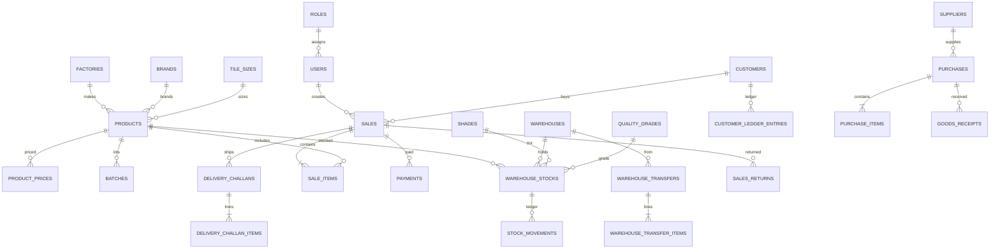

# 07 — Database Design (MySQL)

## Design principles

- 3NF where it does not hurt POS reads; controlled denormalization = cached `qty_sqft`, document totals, line snapshots.
- DECIMAL for money and SQFT; never FLOAT.
- FKs on all relations.
- Soft delete on master data (`deleted_at`); documents more often `status=cancelled` than delete.
- `created_by`, `updated_by`, timestamps on transactional tables.
- Unique keys on lot stock rows.

## Why no `product_variants` table in MVP

Shade/batch/quality are stock dimensions, not catalog variants. A variant table would duplicate the stock key. Add later only if size/color are sold as separate SKUs with different conversion factors — those are separate `products`.

## Tables

### users
Purpose: login identities.  
Columns: id PK, name, email UNIQUE, username UNIQUE NULL, phone, password, role_id FK, locale default `en`, default_warehouse_id FK NULL, is_active, remember_token, timestamps, deleted_at.  
Indexes: email, role_id.

### roles
id, name UNIQUE, slug UNIQUE, timestamps.

### permissions
id, name UNIQUE, slug UNIQUE, module, timestamps.

### role_permission
role_id, permission_id PK composite.

### factories
id, name, name_bn NULL, code UNIQUE NULL, is_active, timestamps, deleted_at.

### brands
id, name, name_bn NULL, factory_id NULL FK, is_active, timestamps, deleted_at.

### tile_sizes
id, label (`600x600`), length_mm NULL, width_mm NULL, default_sqft_per_piece NULL, timestamps.

### units
id, code UNIQUE (`BOX`,`PCS`,`SQFT`), name, name_bn, is_system TINYINT.

### quality_grades
id, code UNIQUE, name, name_bn, is_sellable default 1, sort_order.

### shades
id, product_id NULL FK (null = global), code, name NULL, unique (product_id, code).

### products
id, sku UNIQUE, name, name_bn NULL, brand_id FK NULL, factory_id FK NULL, tile_size_id FK NULL, pieces_per_box INT NOT NULL, sqft_per_piece DECIMAL(12,6) NOT NULL, sqft_per_box DECIMAL(16,6) generated or stored, barcode NULL, requires_batch TINYINT default 1, requires_shade TINYINT default 1, default_quality_id FK, is_active, timestamps, deleted_at.  
Indexes: sku, brand_id, name.

### product_prices
id, product_id FK, unit_code, price DECIMAL(16,2), unique(product_id, unit_code).

### warehouses
id, code UNIQUE, name, name_bn NULL, address NULL, type ENUM('showroom','godown','virtual'), is_active, timestamps, deleted_at.  
Virtual warehouse optional for in-transit.

### batches
id, product_id FK, code, manufactured_on NULL, notes NULL, unique(product_id, code), timestamps.

### warehouse_stocks
id, product_id FK, batch_id FK, shade_id FK, quality_grade_id FK, warehouse_id FK, condition ENUM('sellable','damaged') default sellable, qty_sqft DECIMAL(16,4) NOT NULL default 0, timestamps.  
**UNIQUE** (`product_id`,`batch_id`,`shade_id`,`quality_grade_id`,`warehouse_id`,`condition`).  
Indexes: warehouse_id+product_id, qty_sqft (low stock queries via app).

### stock_movements
id, warehouse_stock_id FK, product_id, warehouse_id, batch_id, shade_id, quality_grade_id, condition, direction ENUM('in','out'), qty_sqft DECIMAL(16,4), qty_input DECIMAL(16,4), unit_code, pieces_per_box_snapshot, sqft_per_piece_snapshot, movement_type ENUM('opening','purchase','purchase_return','sale','sale_return','transfer_out','transfer_in','transfer_transit','adjustment','damage','cancel'), document_type VARCHAR, document_id BIGINT, note NULL, occurred_at, created_by, created_at.  
**No updated_at overwrite; immutable.** Indexes: document, product+occurred_at, warehouse_stock_id.

### customers
id, code UNIQUE, name, name_bn NULL, phone, alt_phone NULL, address NULL, credit_limit DECIMAL(16,2) NULL, opening posted via ledger, is_walk_in TINYINT default 0, is_active, cached_balance DECIMAL(16,2) default 0, timestamps, deleted_at.  
Index phone.

### suppliers
Same pattern without walk-in; cached_balance payable.

### purchases
id, number UNIQUE, supplier_id FK, warehouse_id FK, status ENUM('draft','ordered','partial','received','cancelled'), order_date, notes, subtotal, discount, total, created_by, timestamps.

### purchase_items
id, purchase_id FK, product_id, batch_id NULL (may assign at receive), shade_id NULL, quality_grade_id, unit_code, qty_ordered DECIMAL(16,4), qty_received DECIMAL(16,4) default 0, qty_sqft_ordered, unit_price, line_total, factor snapshots.

### goods_receipts / goods_receipt_items
Receive header linked to purchase nullable (direct receive allowed). Posts stock.

### sales
id, number UNIQUE, customer_id FK, warehouse_id FK, status ENUM('draft','posted','cancelled'), source ENUM('pos','backoffice'), sale_at, subtotal, discount_total, tax_total default 0, grand_total, paid_total, due_total, created_by, cancelled_by NULL, cancel_reason NULL, timestamps.

### sale_items
id, sale_id, product_id, batch_id, shade_id, quality_grade_id, condition default sellable, unit_code, qty_input, qty_sqft, unit_price, discount_amount, line_total, factor snapshots.

### payments
id, number UNIQUE, party_type ENUM('customer','supplier'), customer_id NULL, supplier_id NULL, method ENUM('cash','bank','mfs','other'), amount DECIMAL(16,2), direction ENUM('in','out'), paid_at, sale_id NULL, notes, reversed_at NULL, created_by, timestamps.

### payment_allocations
id, payment_id, document_type, document_id, amount. Optional MVP Should Have.

### customer_ledger_entries
id, customer_id, entry_at, debit DECIMAL(16,2) default 0, credit DECIMAL(16,2) default 0, description, document_type, document_id, created_by, created_at. Immutable. Balance = sum(debit)-sum(credit) with sign convention **debit increases receivable**.

### supplier_ledger_entries
Mirror: credit increases payable on purchase.

### warehouse_transfers
id, number UNIQUE, from_warehouse_id, to_warehouse_id, status ENUM('draft','dispatched','partial_received','received','cancelled'), dispatched_at NULL, received_at NULL, created_by, timestamps.

### warehouse_transfer_items
id, transfer_id, product_id, batch_id, shade_id, quality_grade_id, unit_code, qty_input, qty_sqft, qty_received_sqft default 0.

### delivery_challans
id, number UNIQUE, customer_id, warehouse_id, sale_id NULL, destination_address, driver_name NULL, vehicle_no NULL, status ENUM('draft','dispatched','delivered','cancelled'), dispatched_at NULL, notes, created_by, timestamps.

### delivery_challan_items
id, challan_id, product_id, lot FKs, unit_code, qty_input, qty_sqft.

### sales_returns / sales_return_items
Header linked sale_id; restock_mode; money_action refund|credit.

### purchase_returns / items
Similar.

### notifications / sms_logs
sms_logs: id, provider, to_phone, body, status, provider_message_id, payload JSON, created_at.

### settings
key UNIQUE, value JSON or text.

### activity_logs
id, user_id, action, subject_type, subject_id, properties JSON, ip, created_at.

### expenses (optional)
id, category, amount, spent_at, notes — Could Have.

## ERD

## Normalization, indexes, FK, delete, concurrency

- Indexes: unique invoice numbers; stock unique key; movements (document_type, document_id); ledger customer_id+entry_at; products sku.
- FK restrict on products referenced by stock; cascade delete only on child items when parent draft deleted.
- Soft delete products; block if qty != 0.
- Transactions required for checkout, receive, transfer dispatch/receive, cancel.
- Concurrency: `SELECT … FOR UPDATE` on `warehouse_stocks` rows; optional `version` column for optimistic UI.
- Audit: activity_logs + movement immutability + ledger immutability.
- Inventory consistency: cached qty updated only with movement insert in one TX; scheduled checksum SUM(movements) vs cache.
