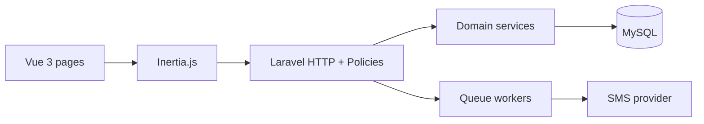
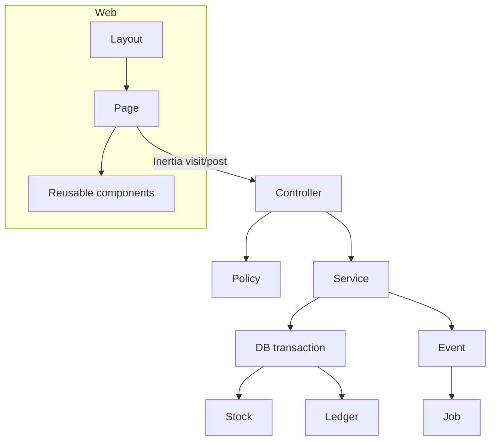

# 08 — System Architecture

## Primary flow



Do not split a public JSON API as the main UI transport. Inertia visits + Form posts are the app. JSON endpoints exist for POS search, SMS webhooks, and future mobile.

## Laravel structure (recommended, not over-layered)

```
app/
  Http/Controllers/     # thin
  Http/Requests/
  Http/Middleware/
  Models/
  Policies/
  Services/             # StockService, SaleCheckoutService, LedgerService, ConversionService
  Domain/Inventory/     # optional later if services grow
  Jobs/SendSmsJob
  Events/SalePosted
  Listeners/
  Notifications/
```

- Controllers: authorize + call service + redirect/Inertia.
- Form Requests: validation only.
- Models: relations, casts (`decimal:4`), no multi-table writes.
- Services: transactions and domain rules.
- Policies: map to permission slugs.
- Jobs: SMS, heavy report export.
- Events: SalePosted, PaymentReceived, StockAdjusted.
- Errors: domain exceptions (`InsufficientStockException`) → 422 with code.

## Vue + Inertia

```
resources/js/
  Pages/Auth/Login.vue
  Pages/Dashboard/Index.vue
  Pages/Pos/Index.vue
  Pages/Products/...
  Layouts/AppLayout.vue
  Components/DataTable.vue, UnitQtyInput.vue, LotPicker.vue, Money.vue
```

- State: page props from Laravel. POS cart in component state (Pinia optional only for POS cart persist). **Recommendation:** Pinia for POS cart only; everything else server-driven.
- Forms: Inertia `useForm`.
- Tables: server pagination, filters as query params.

## Architecture diagrams



## Validation & errors

- Server is authority.
- POS shows structured error codes: `STOCK_INSUFFICIENT`, `CREDIT_LIMIT`, `LOT_REQUIRED`.

## Why this is not over-engineered

No CQRS, no microservices, no DDD folder theater. One app, services where transactions span models.

## Supporting tech (justified)

| Tech | Why |
|---|---|
| Laravel Queue + Redis/database driver | SMS retry |
| Laravel Excel or league/csv | Report export |
| DomPDF or browser print | Invoices — prefer browser print first |
| Spatie permission *or* simple tables | RBAC; either is fine; custom tables already specified |

Do not add React Native, Elasticsearch, or Kafka in MVP. MySQL `LIKE` + indexes enough to 10k SKUs; add Scout later if needed.
