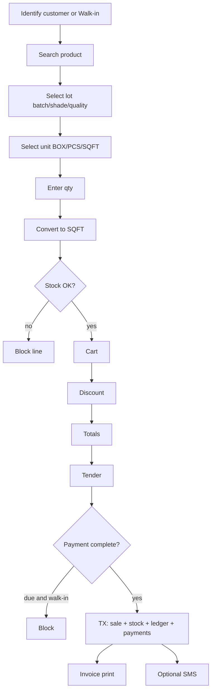

# 11 — POS and Sales Workflow

## Steps in detail

1. **Customer** — Walk-in allowed for cash only. Named customer for credit.
2. **Search** — SKU, barcode, name EN/BN.
3. **Lot** — Required when multiple stock rows; show available converted qty.
4. **Unit & qty** — ConversionService.
5. **Price** — Default from product_prices for unit; override if permitted.
6. **Cart** — Multiple lines same product different lots OK; same lot merge optional.
7. **Discount** — Line and header; cap unless `sales.discount.unlimited`.
8. **Pay** — Split: cash + MFS + due.
9. **Due** — `grand_total - paid_total`; ledger debit grand_total, credit paid.
10. **Stock** — deduct sellable SQFT.
11. **SMS** — after commit.

## Modes

| Mode | Behavior |
|---|---|
| Cash | paid = total, due 0 |
| Credit | paid 0, due = total |
| Partial | both |
| Out of stock | block or allow if negative on |
| Return | not in POS cart; use return screen |
| Cancel | back office |
| Edit | not after post |

## Invoice cancellation / editing

Cancel: reversing sale movements, reverse receivable, handle payments as refund or advance.  
Edit: forbidden on posted docs.

## Print

A4 / 80mm thermal layout using CSS print. Include BN/EN based on setting.
