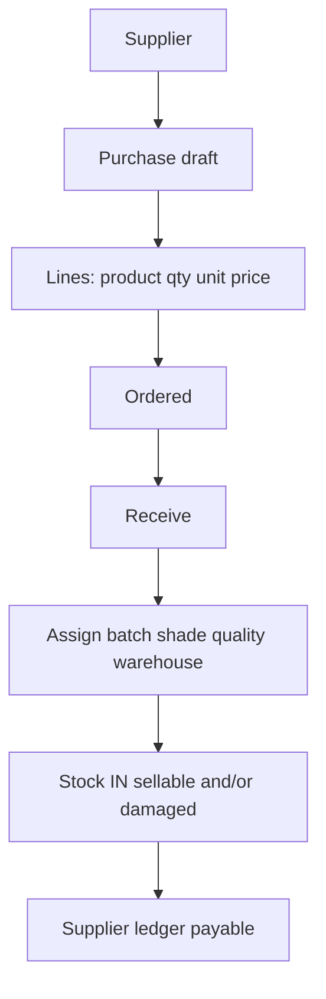

# 12 — Purchase Workflow

## Receiving

- Partial receive allowed; `qty_received` accumulates.
- Status: draft → ordered → partial → received.
- Direct receive without PO: allowed for small shops (creates purchase implied or `goods_receipt` standalone). **Assumption A-PUR-1:** standalone GR creates a purchase document automatically so payables stay consistent.

## Damaged receiving

Split qty on UI: 100 box good + 2 box damaged → two movement conditions.

## Purchase return

Select received lots, qty not exceeding remaining (received − already returned), stock OUT, supplier ledger debit (reduce payable) or create receivable if already paid.

## Corrections

Wrong batch posted: do not edit movement. Adjustment OUT wrong lot + IN correct lot with reason `receive_correction`, linked documents.
