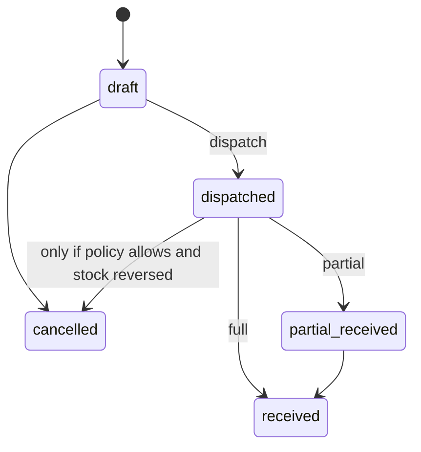

# 13 — Warehouse Workflow

## Creation
Code, name, type showroom/godown. Cannot delete if stock ≠ 0.

## Stock view
Per warehouse lot grid with unit conversions.

## Transfer

### Inventory effect

| Event | Source sellable | In-transit | Dest sellable |
|---|---|---|---|
| Draft | 0 | 0 | 0 |
| Dispatch | −qty | +qty | 0 |
| Receive | 0 | −qty | +qty |
| Cancel after dispatch before receive | +qty back | −qty | 0 |

In-transit implementation: `condition` not used; use movement types + optional virtual warehouse `INTRANSIT`. **Recommend virtual warehouse** so unique stock key still applies (warehouse_id = in-transit WH).

## Approval
MVP: Manager/Warehouse can dispatch. Optional `require_transfer_approval` setting default false.

## Adjustment
Permissioned count variance.

## Permissions
Warehouse role can be scoped later via `warehouse_user` pivot (Should Have).

## Reports
On-hand by WH, in-transit aging, movements.
